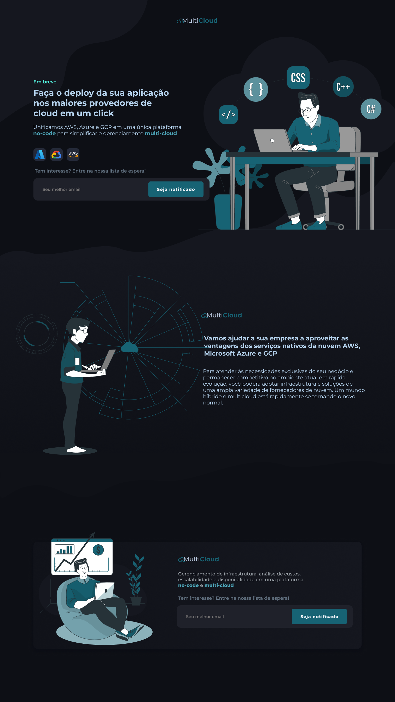

### Problema
Para atender às necessidades exclusivas do seu negócio e permanecer competitivo no ambiente atual em rápida evolução, você poderá adotar infraestrutura e soluções de uma ampla variedade de fornecedores de nuvem. Um mundo híbrido e multicloud está rapidamente se tornando o novo normal.

Mas gerenciar seus serviços e dados baseados em nuvem em vários provedores pode parecer complicado. Como cada conjunto de serviços em nuvem vem com suas próprias ferramentas, você provavelmente enfrentará maior complexidade e custos. Novas soluções de gerenciamento e métodos de entrega podem ajudar a otimizar o desempenho, controlar custos, fornecer acesso rápido à nuvem e proteger sua combinação de aplicativos, ambientes e dados na nuvem.

### Solução
Gerenciamento de infraestrutura, análise de custos, escalabilidade e disponibilidade em uma plataforma no-code e multi-cloud. Simplificada e unificada!

### Diferencial
As soluções do mercado exigem um time especializado para gerenciá-las, sendo inviável para pequenas e médias empresas. Além de não oferecerem todos os serviços de forma integrada.

### Protótipo

